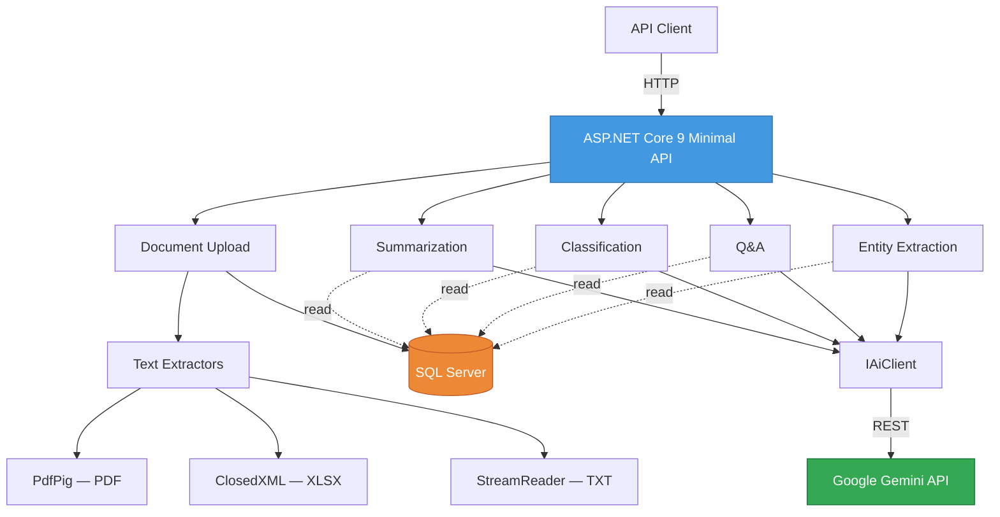

# DocuMind

AI-powered document analysis API built with ASP.NET Core Minimal API and Google Gemini.  
Upload a PDF, Excel, or text file and get instant AI-driven insights.

---

## What It Does

DocuMind is a REST API that accepts documents and uses AI to analyze them in five ways:

- **Upload** — accepts PDF, XLSX, and TXT files, extracts text automatically
- **Summarize** — generates short, medium, or detailed summaries
- **Classify** — categorizes documents and assigns relevant tags
- **Q&A** — answers natural language questions based on document content
- **Extract** — pulls out people, dates, monetary amounts, locations, and organizations

The API handles all AI communication behind the scenes. The consumer just uploads a document, picks a feature, and gets a structured JSON response.

---

## Architecture



The project uses a **feature folder** structure instead of Clean Architecture. Each feature (Summarization, Classification, etc.) is self-contained with its own endpoint, service, and models. Shared concerns like the AI client and text extractors live in an `Infrastructure` folder. This decision is documented in [ADR-0001](docs/adr/0001-feature-folders-over-clean-architecture.md).

---

## Tech Stack

| Layer | Technology |
|-------|-----------|
| Runtime | .NET 9, ASP.NET Core Minimal API |
| Database | SQL Server with Dapper |
| AI | Google Gemini API (gemini-2.5-flash-lite) |
| PDF Processing | PdfPig |
| Excel Processing | ClosedXML |
| API Documentation | Scalar (OpenAPI) |

---

## Project Structure

```
DocuMind/
├── Features/
│   ├── Documents/          # Upload, storage, text extraction orchestration
│   ├── Summarization/      # AI-powered document summarization
│   ├── Classification/     # AI-powered document categorization
│   ├── QnA/                # AI-powered question answering
│   └── Extraction/         # AI-powered named entity recognition
├── Infrastructure/
│   ├── AI/                 # IAiClient interface + GeminiClient implementation
│   └── Storage/            # ITextExtractor + PDF, Excel, TXT extractors
├── docs/
│   └── adr/                # Architecture Decision Records
├── Program.cs
├── appsettings.json
└── README.md
```

---

## Getting Started

### Prerequisites

- [.NET 9 SDK](https://dotnet.microsoft.com/download/dotnet/9.0)
- [SQL Server](https://www.microsoft.com/en-us/sql-server/sql-server-downloads) (LocalDB, Express, or full)
- [Google Gemini API key](https://aistudio.google.com) (free tier available)

### 1. Clone the repository

```bash
git clone https://github.com/yourusername/DocuMind.git
cd DocuMind
```

### 2. Create the database

Run this in SQL Server Management Studio or any SQL client:

```sql
CREATE DATABASE DocuMind;
GO

USE DocuMind;
GO

CREATE TABLE Documents (
    Id UNIQUEIDENTIFIER PRIMARY KEY DEFAULT NEWID(),
    FileName NVARCHAR(255) NOT NULL,
    FileExtension NVARCHAR(10) NOT NULL,
    ExtractedText NVARCHAR(MAX) NOT NULL,
    Status NVARCHAR(50) NOT NULL DEFAULT 'Ready',
    FileSizeBytes BIGINT NOT NULL,
    CreatedAt DATETIME2 NOT NULL DEFAULT GETUTCDATE()
);
```

### 3. Configure the application

Create `appsettings.Development.json` in the project root:

```json
{
  "ConnectionStrings": {
    "DefaultConnection": "Server=localhost;Database=DocuMind;Trusted_Connection=true;TrustServerCertificate=true;"
  },
  "Gemini": {
    "ApiKey": "your-gemini-api-key"
  }
}
```

### 4. Run

```bash
dotnet run
```

Open Scalar API docs at `https://localhost:7067/scalar`

---

## API Reference

### Upload a document

```
POST /api/documents/upload
Content-Type: multipart/form-data
```

Accepts `.pdf`, `.xlsx`, and `.txt` files. Returns document ID and a preview of the extracted text.

```json
{
  "id": "d3f1a2b4-...",
  "fileName": "report.pdf",
  "fileExtension": ".pdf",
  "status": "Ready",
  "fileSizeBytes": 94208,
  "extractedTextPreview": "First 200 characters of extracted text..."
}
```

### Get document info

```
GET /api/documents/{id}
```

### Summarize

```
POST /api/summarize
Content-Type: application/json

{
  "documentId": "d3f1a2b4-...",
  "length": "short"        // "short" | "medium" | "detailed"
}
```

### Classify

```
POST /api/classify
Content-Type: application/json

{
  "documentId": "d3f1a2b4-..."
}
```

Returns category, subcategory, and tags:

```json
{
  "documentId": "d3f1a2b4-...",
  "category": "Financial",
  "subCategory": "Annual Report",
  "tags": ["revenue", "growth", "SaaS", "IT sector"]
}
```

### Ask a question

```
POST /api/ask
Content-Type: application/json

{
  "documentId": "d3f1a2b4-...",
  "question": "What was the total revenue in 2025?"
}
```

### Extract entities

```
POST /api/extract
Content-Type: application/json

{
  "documentId": "d3f1a2b4-..."
}
```

Returns structured entities:

```json
{
  "documentId": "d3f1a2b4-...",
  "people": ["Marko Petrovic", "Ana Djukanovic"],
  "dates": ["15.03.2025", "31.12.2025"],
  "amounts": ["8,700,000 EUR", "1,922,700 EUR"],
  "locations": ["Podgorica", "Belgrade", "Berlin"],
  "organizations": ["TechNova Solutions", "NLB Banka", "Microsoft"]
}
```

---

## Architecture Decisions

Design decisions are documented as Architecture Decision Records:

| ADR | Decision |
|-----|----------|
| [ADR-0001](docs/adr/0001-feature-folders-over-clean-architecture.md) | Feature folders over Clean Architecture |
| [ADR-0002](docs/adr/0002-gemini-api-as-ai-provider.md) | Gemini API as AI provider |
| [ADR-0003](docs/adr/0003-dapper-over-ef-core.md) | Dapper over Entity Framework Core |
| [ADR-0004](docs/adr/0004-minimal-api-over-controllers.md) | Minimal API over controllers |

---

## Swapping the AI Provider

The AI client is abstracted behind `IAiClient`:

```csharp
public interface IAiClient
{
    Task<string> SendPromptAsync(string systemPrompt, string userContent);
}
```

To switch from Gemini to OpenAI or Claude, create a new implementation and register it in `Program.cs`. No feature code needs to change.

---

## Supported File Types

| Type | Extension | Extraction Method |
|------|-----------|-------------------|
| PDF | `.pdf` | PdfPig — page-by-page text extraction |
| Excel | `.xlsx` | ClosedXML — reads all sheets, formats cells as pipe-separated text |
| Plain Text | `.txt` | Direct StreamReader read |

---

## License

[MIT](LICENSE)
